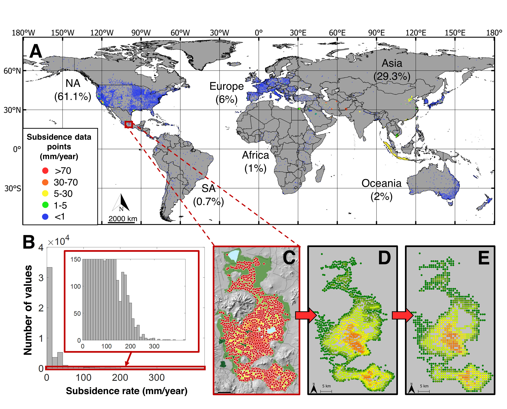
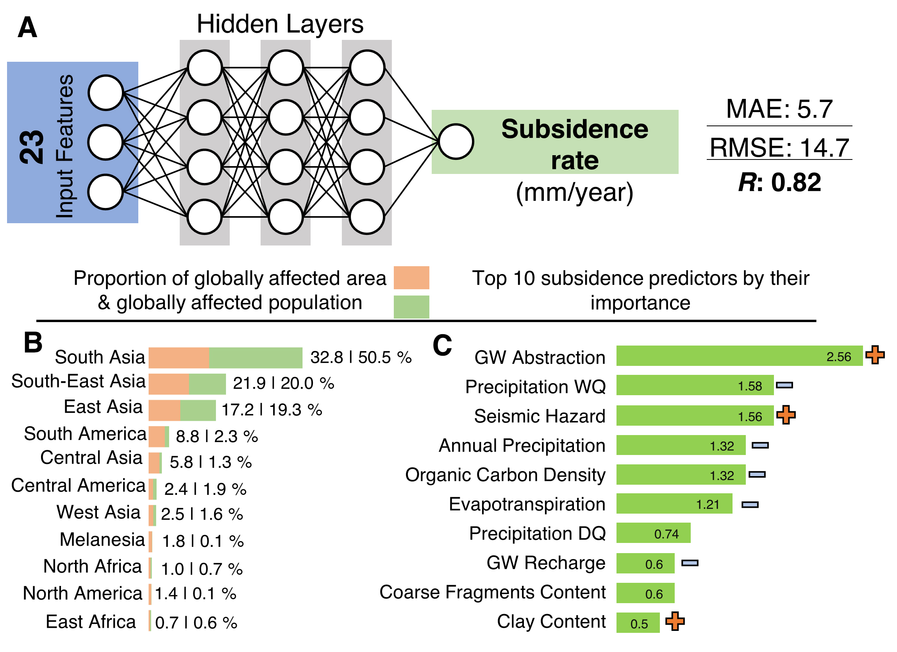
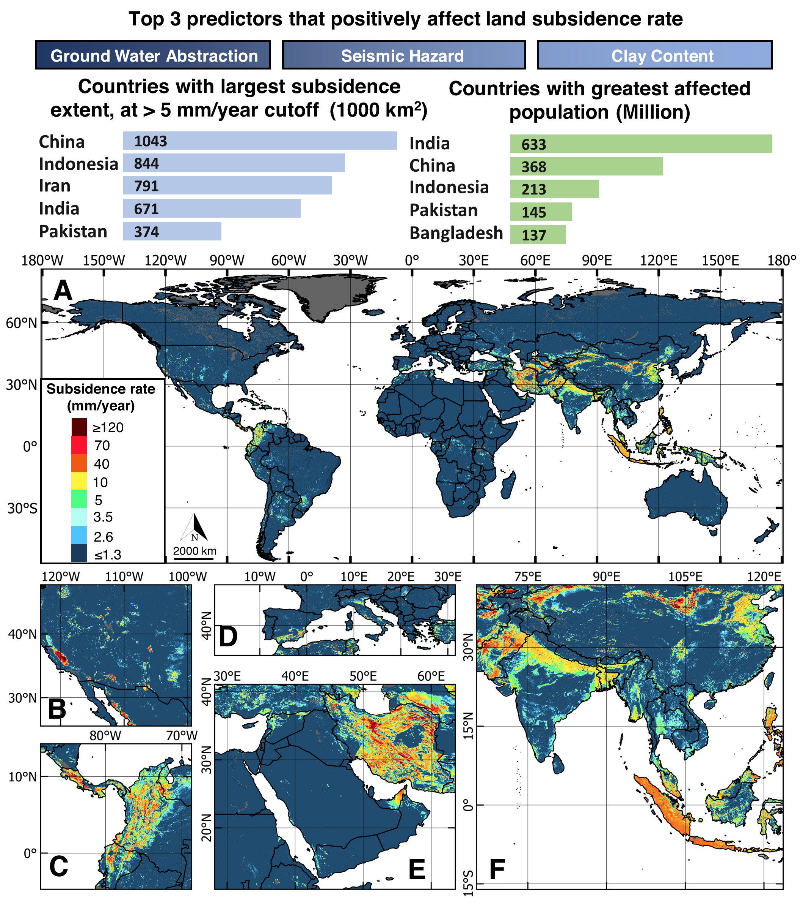

# Geospatial Land Subsidence Prediction

This repository provides a comprehensive workflow for global prediction of land subsidence using machine learning and geospatial data. The pipeline integrates data preprocessing, feature engineering, model training, prediction, and result visualization, enabling robust analysis of subsidence rates and their environmental drivers.

## Workflow Overview

The main steps in the pipeline are:

1. **Mask Creation**  
   Generates a mask raster based on specified conditions and regions to exclude invalid or irrelevant areas from analysis.

2. **Raster Processing**  
   Processes geospatial raster files, interpolates missing data, and extracts feature values for valid locations.

3. **Data Cleanup**  
   Identifies and removes no-data indices across all features to ensure consistency in downstream analysis.

4. **Zero Subsidence Data Generation**  
   Samples locations with zero subsidence for model training, balancing the dataset.

5. **Subsidence Assignment**  
   Assigns subsidence rates from point observations to the nearest valid grid cells and merges with predictor data.

6. **Feature Transformation Pipeline**  
   Fits and saves individual transformers for each feature, including scaling and encoding, to standardize inputs for the model.

7. **Model Training**  
   Trains a neural network on the processed dataset, evaluates performance, and saves model weights.

8. **Map Prediction**  
   Generates global subsidence predictions and exports results as georeferenced raster maps.

## Repository Structure

## Repository Structure

    .
    ├── Paper.pdf
    ├── Supplementary_Information.pdf
    ├── README.md
    ├── figures/                              # Figures used in the paper and README
    │   ├── main_idea.jpg
    │   ├── methods_and_results.jpg
    │   └── result_map_and_statistics.jpg
    └── code/                                 # End-to-end pipeline
        ├── config.yaml                       # Master configuration for paths, masks, features
        ├── create_mask.py                    # 1) Build analysis mask
        ├── process_raster.py                 # 2) Ingest rasters, interpolate, extract features
        ├── cleanup.py                        # 3) Remove no-data indices across features
        ├── create_zero_subsidence_data.py    # 4) Sample zero-subsidence points
        ├── assign_subsidence.py              # 5) Map observed subsidence to grid cells
        ├── fit_pipeline.py                   # 6) Fit/save per-feature transformers
        ├── train_model.py                    # 7) Train NN model and save weights
        ├── map_prediction.py                 # 8) Predict global maps and export rasters
        ├── feature_importance.py             # SHAP-based importance computation
        ├── feature_statistics.py             # Summary stats for predictors/targets
        ├── zonal_statistics.py               # Region-wise (e.g., continents) statistics
        ├── utils_general.py                  # Shared helpers (I/O, math, logging, etc.)
        └── utils_osgeo.py                    # GDAL/OGR raster-vector utilities

## Key Features

- **Flexible Masking:** Easily configure masking conditions and regions.
- **Automated Feature Extraction:** Supports interpolation and extraction of multiple environmental predictors.
- **Robust Data Cleaning:** Ensures all features are aligned and free of missing values.
- **Balanced Training Data:** Incorporates both observed and zero subsidence samples for unbiased model learning.
- **Scalable Model Training:** Utilizes TensorFlow/Keras for efficient neural network training.
- **Explainable Results:** Computes feature importance using SHAP and provides summary statistics.
- **Geospatial Output:** Produces global subsidence maps in standard GIS formats.

## Getting Started

1. **Configure the Pipeline:**  
   Edit `config.yaml` to specify input raster locations, output directories, masking rules, and feature settings.

2. **Run the Workflow:**  
   Execute the scripts in the following order:
   - `python code/create_mask.py`
   - `python code/process_raster.py`
   - `python code/cleanup.py`
   - `python code/create_zero_subsidence_data.py`
   - `python code/assign_subsidence.py`
   - `python code/fit_pipeline.py`
   - `python code/train_model.py`
   - `python code/map_prediction.py`

3. **Visualize Results:**  
   Output maps and statistics are saved in the results directory. Example figures are provided in `figures/`.

## Documentation

- **Code Documentation:**  
  Each script contains detailed comments explaining its functionality and usage.
- **Figures:**  
  - `main_idea.jpg`: Data sources and digitization workflow.
  - `methods_and_results.jpg`: Global prediction and feature importance.
  - `result_map_and_statistics.jpg`: Model architecture and summary statistics.

- **Paper & Supplementary Information:**  
  - `Paper.pdf`
  - `Supplementary_Information.pdf`

## Figures

(a)—Locations of recorded subsidence rates. Includes 34 sources with reported subsidence maps that were subsequently digitized and converted to points at 30″ resolution, 193 sources with a single subsidence point per source, and 19221 GPS stations. (b)—Frequency distribution of the subsidence rates. (c–e)—Digitization workflow. (c)—Points detected by the digitization algorithm, based on the provided colors in the legend of the original image in Figure S1 of the Supporting Information S1. (d)—Visualization of the extracted points in GIS software, based on extracted longitude, latitude, and rates. (e)—Final locations of the points, after resampling and snapping on the 30″ tiles of the predictor maps.

Global prediction of land subsidence, with relevant feature importance and zonal statistics at the top of the figure. Modeled subsidence rates for the entire globe (a), zoomed-in maps of land subsidence for North America (b), South America (c), Europe and North Africa (d), Middle East (e), and South, East, and South-East Asia (f). The zoomed in maps were visualized with unique color scales that are different from the global map (a) and are included in Supporting Information S1 with additional maps of land subsidence at global, continental, and regional level in Figures S8–S14 of the Supporting Information S1. The model was trained using the subsidence data points presented in Figure 1 and a comprehensive set of environmental parameters listed in Table S2 of the Supporting Information S1. Gaussian smoothing has been applied to enhance the visualization (including Figures S8–S14 in Supporting Information S1).

Summary of the methodology and results. Simplified architecture of utilized machine learning model (a), proportions of land area and population affected worldwide by land subsidence larger than 5 mm/year by region (b), and importance and impact of the predictors (c).

## Citation

If you use this repository in your research, please cite the associated paper (see Paper.pdf).

---

For questions or contributions, please open an issue or contact me at [tdavydzenka@mines.edu](mailto:tdavydzenka@mines.edu).